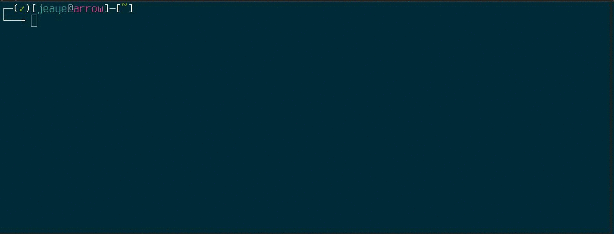

C++ stdlib man pages
======
stdman is a tool that parses archived HTML files from [cppreference](http://cppreference.com) and generates groff-formatted manual pages for Unix-based systems. The goal is to provide excellent formatting for easy readability. stdman has been tested on Linux and OS X.



### Installation
There's no need to compile stdman if you just want to install the man pages. Instead, just run:
```bash
./configure
make install # as a user with appropriate permissions to install
```
If you need to pass options to configure, you can do so. See `./configure --help` for more updated information.  

### Troubleshooting
If you're getting 'no manual entry for std::foo' or you're seeing the libstdc++ man pages (characterized by a huge list of typedefs when you run `man std::string`), see the following. By default, stdman will install to `/usr/local`; on some systems, the manpath does not look there first. To fix this, you have two options:  
* Install to `/usr/share`:
```bash
./configure --prefix=/usr # will replace existing libstdc++ pages
make install
```
* Manage your `MANPATH` in your `~/.bashrc` (or similar):
```bash
export MANPATH=/usr/local/man:/usr/local/share/man:/usr/share/man:/usr/man
```

#### If your output is not colorized
You either need to set your pager up to colorize man pages, or you need to install a pager to do this for you. `less` will not do this by default, but it's easy enough to add. `most` will do this by default, but it doesn't ship with vim-like navigation.

**To configure less:**
```bash
# Colors
default=$(tput sgr0)
red=$(tput setaf 1)
green=$(tput setaf 2)
purple=$(tput setaf 5)
orange=$(tput setaf 9)

# Less colors for man pages
export PAGER=less
# Begin blinking
export LESS_TERMCAP_mb=$red
# Begin bold
export LESS_TERMCAP_md=$orange
# End mode
export LESS_TERMCAP_me=$default
# End standout-mode
export LESS_TERMCAP_se=$default
# Begin standout-mode - info box
export LESS_TERMCAP_so=$purple
# End underline
export LESS_TERMCAP_ue=$default
# Begin underline
export LESS_TERMCAP_us=$green
```

**To install most:**  
Arch: `pacman -S most`  
Ubuntu: `apt-get install most`
```bash
export MANPAGER=most # in ~/.bashrc or similar
```

### Building/Generating
Should you want to build the source to make modifications and/or generate your own man pages, simply:
```bash
make generate # will build stdman and generate man pages
```
**NOTE**: `make generate` expects sources will be in the `./reference/en/cpp` directory by default. See `./configure --help` to modify this.

### Compilation/Generation Dependencies
* C++11 (recommended GCC 4.9 or clang 3.4 or greater)
* elinks (recommended 0.12pre6 or greater)
* gzip (recommended 1.3.12 or greater)

**NOTE**: Generation not tested on Windows/cygwin.
